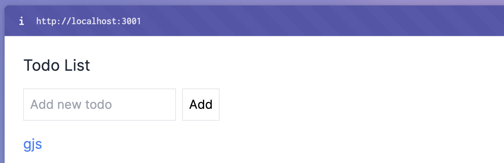

# Sample Fullstack Application


This repository contains a sample fullstack application with a frontend and backend service.

## Setup

1. Clone the repository:

   ```bash
   git clone https://github.com/your-github-username/sample-fullstack-application.git
   cd sample-fullstack-application

2. Running the project:

   ```bash
   cd sample-fullstack-application
   ```
   ```bash
   docker-compose up -d --build

3. Check the URL in browser:
    ```bash
    http://localhost:3001/
    ```

   